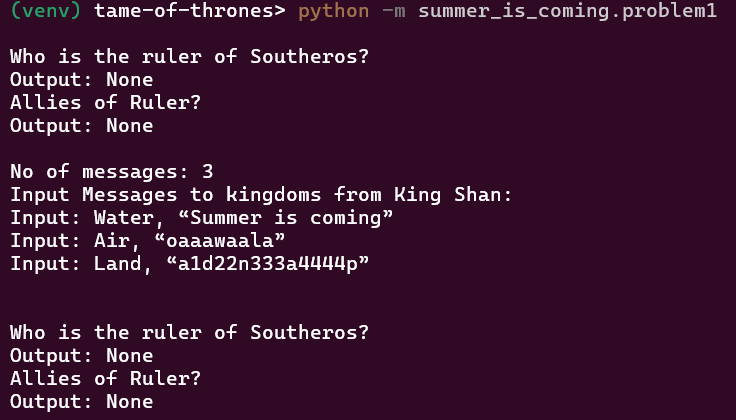

# Tame of Thrones
Pandemonium reigns in the Universe of Southeros, where kingdoms fiercely compete for power and dominance. Bring peace by discovering the rightful ruler. [Endorsed](https://indorse.io/claim-reports/5d9b28c91547030001b96e7a) by Indorse for excellence in coding.

## Problem 1: A Golden Crown
In the universe of Southeros, chaos reigns as there is no ruler. King Shan of the Space kingdom seeks to unite all six kingdoms under his rule. To become the ruler, King Shan needs the allegiance of at least three other kingdoms. Each kingdom has its own emblem animal, and to win a kingdom's allegiance, the secret message sent by King Shan must contain all the letters of the animal in their emblem.

### Kingdoms and Their Emblems
- **Land**: Panda
- **Water**: Octopus
- **Ice**: Mammoth
- **Air**: Owl
- **Fire**: Dragon
- **Space**: Gorilla

For example, secret message to the Land kingdom needs to have the letter 'p','n','d' atleast once and 'a' at-least twice. If he sends "**a**1**d**22**n**333**a**4444**p**" to the Land kingdom, he will win them over.

### How the Game Works
1. King Shan sends secret messages to various kingdoms.
2. A kingdom pledges allegiance if the message contains the letters of its emblem animal.
3. If King Shan wins the allegiance of three or more kingdoms, he becomes the ruler of Southeros.

### Demo
<p align="center">
  
   
</p>

<br>


## Problem 2: Breaker of Chains
Other kingdoms also desire the throne, and war is imminent! To avoid war, the High Priest of Southeros proposes a ballot system to select the ruler. Any kingdom can compete by sending messages to other kingdoms, asking for their allegiance. A kingdom gives its allegiance if the message it receives contains the letters of its emblem animal, but a competing kingdom will not pledge allegiance to another competitor.

### Rules of the Ballot system:
1. Six random messages are selected by the High Priest from a pool of submitted messages.
2. The kingdom that receives the highest number of allegiances becomes the ruler.
3. If there is a tie, the process is repeated for the tied kingdoms.
4. A kingdom cannot give their allegiance twice. If they have given their allegiance once, they will not give their allegiance again even
if they get a second message and the message is correct.

### Message format:
The format of the message dropped in the ballot should contain:
- The Sender kingdom
- The Receiver kingdom
- The Message (should be selected randomly from the message pool in `summer_is_coming/boc_messages.txt`)

### Message pool
```
- Summer is coming
- a1d22n333a4444p
- oaaawaala
- zmzmzmzaztzozh
- Go risk it all
- Let's swing the sword together
- Die or play the game of thrones
- Ahoy! Fight for me with men and money
- Drag on Martin!
- ...
```

### Demo
<p align="center">
  
   
</p>

<br>


## Running the project
The project is written in `python3.7`

### Dependencies
```bash
pip install -r summer_is_coming/requirements.txt
```

Running from CLI:
```bash
cd <root directory of project>
python -m summer_is_coming.problem1
python -m summer_is_coming.problem2
```

### Testing
The test suite runs on pytest. Installing dependencies for testing:
```bash
pip install -r summer_is_coming/requirements-test.txt
```

Running the test suite:<br>
```bash
cd <root directory of project>
pytest -v
```
